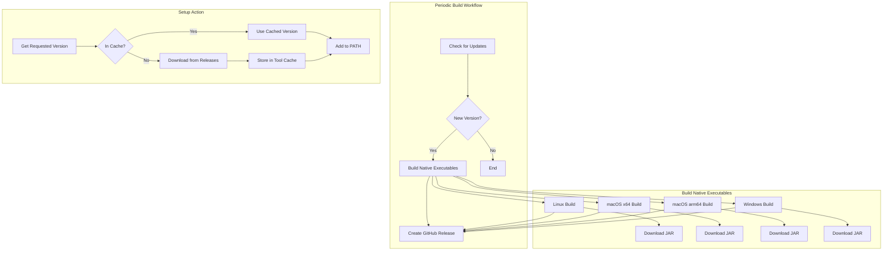

# System Patterns: Setup Crowdin CLI GitHub Action

## System Architecture

The project consists of two main components:

1. **Periodic Build Workflow**
   - Checks for new Crowdin CLI versions
   - Builds native executables using GraalVM
   - Creates GitHub releases with these executables
   - Uses a matrix strategy for building on different platforms
   - Supports tag-based triggers for manual version releases
   - **Optimized to download JAR directly in build jobs**

2. **Setup Action**
   - Downloads the requested version of Crowdin CLI
   - Stores it in the GitHub runner's tool cache
   - Makes it available for use in workflows

## Key Technical Decisions

1. **Native Executables vs. JAR Files**
   - Using GraalVM to create native executables for better performance and simpler usage
   - Eliminates the need for Java runtime on the GitHub runner

2. **GitHub Releases as Distribution Mechanism**
   - Using GitHub Releases to store and distribute the executables
   - Provides versioning and easy access to specific versions

3. **Tool Cache for Efficiency**
   - Using GitHub's tool cache to avoid redundant downloads
   - Improves workflow execution time

4. **Periodic Checking vs. Webhooks**
   - Using scheduled workflows for simplicity
   - Avoids the need for external services or complex event triggers

5. **Single File Distribution for Action**
   - Using @vercel/ncc to compile the action code into a single file
   - Simplifies distribution and eliminates the need for node_modules

6. **Matrix Strategy for Builds**
   - Using GitHub Actions matrix strategy to define build configurations
   - Improves maintainability and scalability
   - Makes it easier to add new platforms or architectures

7. **Optimized JAR Download Process**
   - Each build job downloads the JAR directly instead of using a separate job
   - Reduces workflow complexity and execution time
   - Eliminates the overhead of artifact uploads/downloads between jobs

8. **Concurrency Control**
   - Using GitHub Actions concurrency to prevent workflow conflicts
   - Ensures only one workflow runs for a given reference at a time

9. **Custom Reflection Configuration for GraalVM**
   - Using a custom Java class (`CrowdinReflectionFeature`) to provide explicit reflection configuration
   - Eliminates the need for agent-based configuration generation at build time
   - Provides more control over which classes are included in the native image
   - Results in more optimized and smaller native executables

## Component Relationships

- The periodic build workflow creates the assets that the setup action consumes
- The setup action depends on the releases created by the build workflow
- Both components share version detection and naming conventions
- The build workflow uses matrix jobs with direct JAR downloads for efficiency

## Error Handling Patterns

1. **Version Fallback**
   - If requested version is not available, fall back to latest version
   - Provide clear error messages and warnings

2. **Platform Detection**
   - Automatically detect the runner's platform
   - Download the appropriate executable for the platform

3. **Cache Validation**
   - Verify cached executables before using them
   - Re-download if validation fails

4. **Repository Fallback**
   - If our repository doesn't have a release, check the official Crowdin CLI repository
   - Use the version number from the official repository but still download our custom build

5. **Matrix Job Failure Handling**
   - Individual matrix job failures don't fail the entire workflow
   - Allows for partial success and reporting 