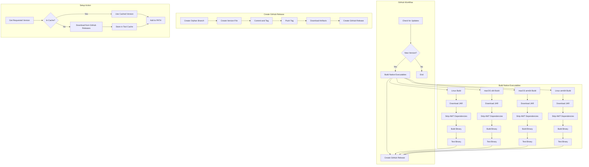

# System Patterns: Setup Crowdin CLI GitHub Action

## System Architecture

The project consists of two main components:

1. **GitHub Workflow for Building and Releasing**
   - Checks for new Crowdin CLI versions
   - Builds native executables using GraalVM
   - Creates GitHub releases with these executables
   - Uses a matrix strategy for building on different platforms
   - Supports manual version releases through workflow dispatch
   - Creates an orphan branch for each version
   - Creates a `.crowdin-version` file with the version number
   - Uses GitHub Script with Octokit for version checking
   - Uses `softprops/action-gh-release` for creating GitHub releases

2. **Setup Action**
   - Downloads the requested version of Crowdin CLI
   - Stores it in the GitHub runner's tool cache
   - Makes it available for use in workflows
   - Uses Octokit for GitHub API interactions
   - Supports platform-specific binary selection

## Key Technical Decisions

1. **Native Executables vs. JAR Files**
   - Using GraalVM to create native executables for better performance and simpler usage
   - Eliminates the need for Java runtime on the GitHub runner

2. **GitHub Releases for Distribution**
   - Using GitHub releases to store and distribute the executables
   - Provides versioning and easy access to specific versions
   - Simplifies version checking and management

3. **Tool Cache for Efficiency**
   - Using GitHub's tool cache to avoid redundant downloads
   - Improves workflow execution time

4. **Periodic Checking vs. Webhooks**
   - Using scheduled workflows for simplicity
   - Avoids the need for external services or complex event triggers

5. **Matrix Strategy for Builds**
   - Using GitHub Actions matrix strategy to define build configurations
   - Improves maintainability and scalability
   - Makes it easier to add new platforms or architectures

6. **Octokit for GitHub API Interactions**
   - Using Octokit for GitHub API interactions
   - Provides better type safety and error handling
   - Simplifies API calls and response handling

7. **GitHub Script for Workflow Operations**
   - Using GitHub Script for workflow operations
   - Simplifies the workflow by allowing JavaScript code directly in the workflow
   - Provides better error handling and logging

8. **Repository Simplification**
   - Focusing solely on the user's repository
   - Hardcoding repository information for simplicity and clarity
   - Streamlining the workflow to reduce complexity

9. **JSDoc Comments for Documentation**
   - Adding JSDoc comments to improve code documentation
   - Provides better type hinting for development
   - Enhances code readability and maintainability

10. **Orphan Branch for Version History**
    - Creating an orphan branch for each version
    - Maintains a clean history for each version
    - Simplifies version management

## Component Relationships

- The GitHub workflow builds native executables and creates GitHub releases
- The setup action downloads executables from GitHub releases and makes them available in workflows
- Both components share version detection and naming conventions
- The workflow uses matrix jobs for building on different platforms
- The setup action uses Octokit for GitHub API interactions
- The workflow uses GitHub Script for version checking and `softprops/action-gh-release` for creating releases

## Error Handling Patterns

1. **Version Fallback**
   - If requested version is not available, fall back to latest version
   - Provide clear error messages and warnings

2. **Platform Detection**
   - Automatically detect the runner's platform
   - Download the appropriate executable for the platform
   - Support explicit platform selection via parameter
   - Fall back to auto-detection if no platform is specified

3. **Cache Validation**
   - Verify cached executables before using them
   - Re-download if validation fails

4. **API Error Handling**
   - Use try/catch blocks for API calls
   - Provide clear error messages for API failures
   - Log detailed error information for debugging

5. **Matrix Job Failure Handling**
   - Individual matrix job failures don't fail the entire workflow
   - Allows for partial success and reporting 