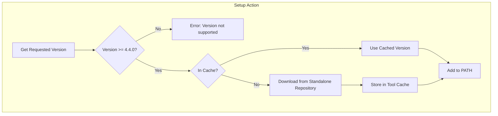

# System Patterns: Setup Crowdin CLI GitHub Action

## System Architecture

The setup action is designed to download and set up the Crowdin CLI for use in GitHub Actions workflows:

1. **Setup Action**
   - Contains the GitHub Action for setting up Crowdin CLI
   - Downloads the requested version of Crowdin CLI from the standalone repository
   - Stores it in the GitHub runner's tool cache
   - Makes it available for use in workflows
   - Uses Octokit for GitHub API interactions
   - Supports platform-specific binary selection
   - Enforces minimum version requirement of Crowdin CLI 4.4.0
   - Maintains compatibility with tool cache

## Key Technical Decisions

1. **Native Executables vs. JAR Files**
   - Using native executables for better performance and simpler usage
   - Eliminates the need for Java runtime on the GitHub runner

2. **GitHub Releases for Distribution**
   - Using GitHub releases to store and distribute the executables
   - Provides versioning and easy access to specific versions
   - Simplifies version checking and management

3. **Tool Cache for Efficiency**
   - Using GitHub's tool cache to avoid redundant downloads
   - Improves workflow execution time

4. **Octokit for GitHub API Interactions**
   - Using Octokit for GitHub API interactions
   - Provides better type safety and error handling
   - Simplifies API calls and response handling

5. **Version Requirements**
   - Enforcing minimum version requirement of Crowdin CLI 4.4.0
   - Provides clear error messages for unsupported versions
   - Ensures compatibility with the latest features and fixes

## Component Relationships

- The setup action downloads executables from the standalone repository and makes them available in workflows
- The action uses Octokit for GitHub API interactions
- The action enforces the minimum version requirement of Crowdin CLI 4.4.0
- The action uses the GitHub Actions tool cache for efficient storage and retrieval

## Error Handling Patterns

1. **Version Fallback**
   - If requested version is not available, fall back to latest version
   - Provide clear error messages and warnings

2. **Platform Detection**
   - Automatically detect the runner's platform
   - Download the appropriate executable for the platform
   - Support explicit platform selection via parameter
   - Fall back to auto-detection if no platform is specified

3. **Cache Validation**
   - Verify cached executables before using them
   - Re-download if validation fails

4. **API Error Handling**
   - Use try/catch blocks for API calls
   - Provide clear error messages for API failures
   - Log detailed error information for debugging 